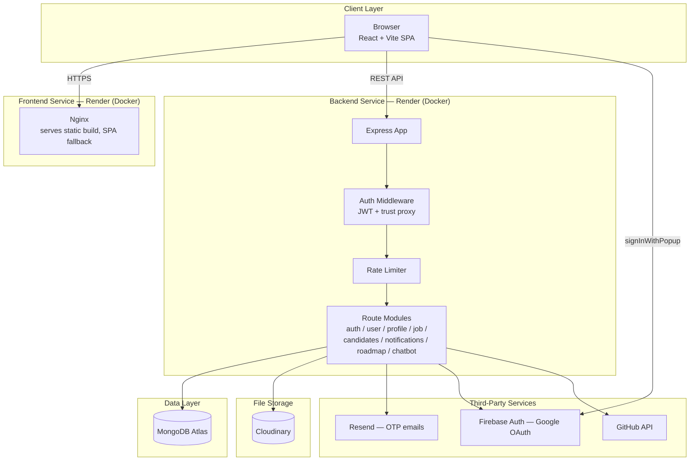

# SkillSphere

SkillSphere is an AI-powered career intelligence platform. Candidates discover their real skills, identify skill gaps, generate a personalized AI career roadmap, and apply to jobs. Companies post openings, review applicants, and get AI-ranked candidate recommendations — hiring based on verified skills and profiles rather than resumes alone.

## Features

**For candidates**
- Sign up with email + OTP or Google OAuth
- Build a structured profile — education, experience, projects, certs, skills
- Sync GitHub repos into your profile automatically
- Get an AI-generated, phased career roadmap toward a target role
- Browse and search jobs, bookmark listings
- Apply with an uploaded resume or your saved profile
- Track application status and get real-time notifications
- Chat with an AI assistant for career guidance

**For companies**
- Post jobs with structured details, salary, perks, and PDF attachments
- Review applicants per job, move them through a hiring pipeline (new → reviewed → shortlisted → interview → hired/rejected)
- Get AI-ranked candidate recommendations on the dashboard
- Manage a company profile and social links

## Tech stack

| Layer | Stack |
|---|---|
| Frontend | React 19, Vite, Tailwind CSS, React Router, Axios |
| Backend | Node.js, Express 5, Mongoose |
| Database | MongoDB Atlas |
| File storage | Cloudinary (resumes, photos, certs, job attachments) |
| Auth | Firebase (Google OAuth) + JWT, email OTP via Resend |
| AI | Groq / Gemini (roadmap generation, chatbot, candidate ranking) |
| Deployment | Docker, Render |

## Architecture



## Project structure

```
skillsphere/
├── src/                    # Frontend (Vite React app, served from repo root)
│   ├── pages/               # user/ and company/ route pages
│   ├── components/          # shared + modal components
│   ├── context/              # React context providers
│   └── services/api.js      # Axios client, VITE_API_URL-based
├── backend/
│   └── src/
│       ├── auth/            # signup/login, OTP, OAuth
│       ├── user/             # account + avatar
│       ├── profile/          # candidate profile builder
│       ├── job/               # job postings + applications
│       ├── candidates/        # company-side candidate views
│       ├── dashboard/         # AI recommendation cache
│       ├── notification/       # in-app notifications
│       ├── roadmap/            # AI roadmap generation
│       ├── chatbot/             # AI chat assistant
│       ├── config/               # db, firebase, cloudinary
│       └── utils/                 # AppError, otp, fileCleanup
├── Dockerfile               # frontend image (Vite build → Nginx)
├── nginx.conf                # SPA fallback + caching
├── backend/Dockerfile         # backend image (Node)
└── vercel.json                 # legacy, unused if deploying via Render Docker
```

## Getting started

### Prerequisites
- Node.js 20+
- A MongoDB Atlas cluster (free M0 tier is fine)
- Accounts for: Cloudinary, Resend, Firebase (Auth), and a Groq/Gemini API key

### 1. Clone and install

```bash
git clone https://github.com/Dazai-arch/skillsphere.git
cd skillsphere

# frontend deps (repo root)
npm install

# backend deps
cd backend && npm install && cd ..
```

### 2. Configure environment variables

Copy the example files and fill them in:

```bash
cp .env.example .env
cp backend/.env.example backend/.env
```

See `.env.example` (frontend) and `backend/.env.example` (backend) for the full list of required keys — Mongo connection string, Firebase Admin credentials, Cloudinary keys, Resend API key, JWT secrets, and AI provider keys.

### 3. Run locally

```bash
# terminal 1 — backend
cd backend
npm run dev        # http://localhost:5000

# terminal 2 — frontend
npm run dev         # http://localhost:5173
```

## Running with Docker

Both frontend and backend have their own `Dockerfile`.

```bash
# Frontend (Vite build baked with VITE_API_URL at build time)
docker build --build-arg VITE_API_URL=http://localhost:5000 -t skillsphere-frontend .
docker run -p 8080:80 skillsphere-frontend

# Backend (env vars passed at runtime)
cd backend
docker build -t skillsphere-backend .
docker run -p 5000:5000 --env-file .env skillsphere-backend
```

## Deployment

Both services deploy independently to [Render](https://render.com) as Docker web services from the same GitHub repo:

| Service | Root directory | Environment | Notes |
|---|---|---|---|
| Backend | `backend` | Docker | Health check: `/health` |
| Frontend | `.` (repo root) | Docker | Build arg: `VITE_API_URL` |

After deploying, set `CLIENT_URL` on the backend to the frontend's live URL (no trailing slash — CORS does an exact-match check), and add the frontend's domain to Firebase Console → Authentication → Authorized domains for Google OAuth to work.

## API overview

All routes are prefixed with `/api`. Key modules:

| Route | Purpose |
|---|---|
| `/api/auth` | Signup (OTP), login, Google OAuth, password reset |
| `/api/user` | Account details, avatar upload |
| `/api/profile` | Candidate profile CRUD, photo/cert uploads |
| `/api/jobs` | Job CRUD, search, apply, attachments |
| `/api/candidates` | Company-side applicant views |
| `/api/dashboard` | AI-ranked candidate recommendations |
| `/api/notifications` | In-app notifications |
| `/api/roadmap` | AI career roadmap generation |
| `/api/chatbot` | AI chat assistant |
| `/api/github` | GitHub repo sync |

`GET /health` returns service status and is used as the Render health check.

## License

Not yet licensed — add a `LICENSE` file (MIT is a common default for open projects) if you intend for others to reuse this code.